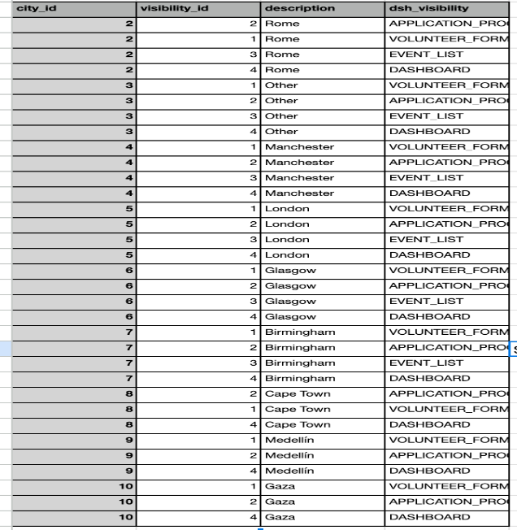
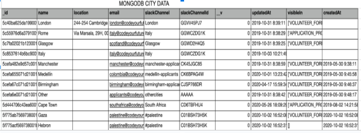

# Proof of Concept Documentation for GraphQL

The aim of this document is to showcase our proficiency in using GraphQL as a query language for data retrieval and manipulation from a PostgreSQL database. This proficiency is crucial for making contributions to the main codebase, particularly when utilizing GraphQL with MongoDB.

In this Proof of Concept (POC) documentation, we will explain the implementation of GraphQL for the CITY table in Code Your Future's PostgreSQL database.

## Dataframes

MongoDB allows for different records to have different fields, but PostgreSQL requires consistency. Although the database has undergone several migrations to maintain data consistency, there may still be records with inconsistencies in columns. We aim to identify any such inconsistencies.

### Scenario: Ensure all data matches after importing Cities data using GraphQL

**GIVEN** I am importing the cities table data from the Dashboard Dev environment.

**WHEN** I compare the data.

**THEN** all 11 rows should match.


PostgreSQL City visibility data





### Comparing Dataframes

The tables above demonstrate that the city data was successfully migrated from MongoDB to PostgreSQL without any inconsistencies in columns or rows.

**Columns:**

- Dataframe generated from MongoDB shows 9 columns:
  - `id`: unique identifier replaced by the autogenerated id in PostgreSQL
  - `name`: matches the description field in PostgreSQL
  - `location`
  - `email`
  - `slackchannel`
  - `slackchannelid`
  - `_v`: a field unique to MongoDB. This field was intentionally omitted in the migration process
  - `updatedat`
  - `visiblein`: comprises an array of strings, which was migrated to PostgreSQL as a one-to-many relation to the city data in PostgreSQL. Refer to the city visibility table above.

**Rows:**

The rows represent the number of records available in our database. There are 11 records in MongoDB and PostgreSQL, showing consistency in the number of records. The number of rows in city-visibility data for each city matches the number of elements in the visible-in array for each city.

## Technologies Used

- **Node.js**: Open-source, cross-platform JavaScript runtime environment. Download it from [Node.js](https://nodejs.org/).

- **NPM**: Software registry that downloads necessary packages to run JavaScript applications. Download it from [NPM](https://www.npmjs.com/).

- **Express.js**: Back-end web application framework for building APIs with Node.js. It's designed for creating web applications and APIs. We use Express.js to build our GraphQL server. To install Express, run the command: `npm install express`.

- **pg Library**: Essential for creating a connection to the Code Your Future (CYF) database. To install it, run the command: `npm install pg`.

- **GraphQL**: Powerful query language for APIs. It allows precise data retrieval, eliminating over-fetching and under-fetching. In GraphQL, there is only one endpoint and one HTTP method, which is POST, for all CRUD operations.

  Two key concepts:
  - Queries retrieve data from the database.
  - Mutations are used for creating, altering, and deleting data. For Mutation operations, you provide values similar to a request body in a REST API.

To implement GraphQL in our POC, we follow these steps:

1. **Database Connection**: Create a database connection using the pg library to execute queries against the CYF database.

2. **Schema Definition**: Define a schema that includes types, Queries, and Mutations.

3. **Resolvers**: Resolvers are responsible for connecting the schema to the service layer, where CRUD operations happen.

4. **Server Setup**: Utilize Express.js to set up our server.

5. **GraphQL.js**: Install the GraphQL.js library by running the command `npm install graphql`. This library is essential for building and executing GraphQL queries and mutations.

6. **Apollo Server**: Use Apollo Server to run our GraphQL server. Apollo is a JavaScript library that offers a user-friendly interface for API operations.

## Running the GraphQL Server

To run our GraphQL server, follow these steps:

1. Navigate to the server folder.
2. Run the command `node app.js`.

This Proof of Concept demonstrates the integration of GraphQL for the CITY table in Code Your Future's PostgreSQL database.

We used Node.js, Express.js, pg library, and Apollo Server to build a GraphQL server. The POC has developed GraphQL-based APIs for Code Your Future.

### Scenarios

#### Scenario 1: Data Retrieval

**GIVEN** there are records in the Cities table and a GraphQL API endpoint is available.

**WHEN** a GraphQL query requesting City data is executed.

**THEN** the API should return a response with the City data without errors.

When you run `http://localhost:4000/graphql` endpoint with the POST method for reading all the data from CITY table, you will get the following response:

- Reading all cities:

```graphql
query Query {
  cities {
    city_id
    location
    description
    email
    slackchannel
    slackchannelid
    created_at
    updated_at
    updated_by
  }
}
```
- Response: 200
```json
{
  "data": {
    "cities": [
      {
        "city_id": "1",
        "location": "New York",
        "description": "The Big Apple",
        "email": "newyork@example.com",
        "slackchannel": "newyork-slack",
        "slackchannelid": "NY123",
        "created_at": "1698705711712",
        "updated_at": "1698705711712",
        "updated_by": 1
      },
      ...
    ]
  }
}
```
-Reading a city by id:

```graphql
query Query($cityId: Int!) {
  city(id: $cityId) {
    city_id
    location
    description
    email
    slackchannel
    slackchannelid
    created_at
    updated_at
    updated_by
  }
}
```
```json
{
  "cityId": 1
}
```
- Response: 200
```json
{
  "data": {
    "city": {
      "city_id": "1",
      "location": "New York",
      "description": "The Big Apple",
      "email": "newyork@example.com",
      "slackchannel": "newyork-slack",
      "slackchannelid": "NY123",
      "created_at": "1698705711712",
      "updated_at": "1698705711712",
      "updated_by": 1
    }
  }
}
```
#### Scenario 2: Filtering and Sorting
**GIVEN there are multiple records in the Cities table and a GraphQL API endpoint is available**

**WHEN a GraphQL query requesting cities data with filtering and sorting is executed**

**THEN the API should return a response with the cities data filtered and sorted as specified in the query**

When you run http://localhost:4000/graphql endpoint with POST method for filtering the data from CITY table from you will get following response:
-- Filtering by location:
```graphql
query Query {
  cities {
    location
  }
}
```
- Response: 200
```json
{
  "data": {
    "cities": [
      {
        "location": "New York"
      },
      {
        "location": "Los Angeles"
      },
      {
        "location": "Chicago"
      },
      {
        "location": "Baker Street"
      }
    ]
  }
}

```
### Scenario 3: Mutation Operations (Create, Update, Delete)
**GIVEN there are records in the Cities table and a GraphQL API endpoint is available**

**WHEN GraphQL mutation queries to create, update, and delete records are executed**

**THEN the API should reflect the changes in the table, and subsequent queries should return the updated data**

When you run http://localhost:4000/graphql endpoint with POST method for creating a new data in the CITY table you will get following response:

- Creating a new city:
```graphql
mutation Mutation($location: String, $description: String, $email: String, $slackchannel: String, $slackchannelid: String) {
  createCity(location: $location, description: $description, email: $email, slackchannel: $slackchannel, slackchannelid: $slackchannelid) {
    city_id
    location
    description
    email
    slackchannel
    slackchannelid
    created_at
    updated_at
    updated_by
  }
}

```
Variables:
```json

{
  "location": "test",
  "description": "test",
  "email": "test",
  "slackchannel": "test",
  "slackchannelid": "test"
  
}
```
- Response: 200
```json
{
  "data": {
    "createCity": {
      "city_id": "5",
      "location": "test",
      "description": "test",
      "email": "test",
      "slackchannel": "test",
      "slackchannelid": "test",
      "created_at": "1698705711712",
      "updated_at": "1698705711712",
      "updated_by": 1
    }
  }
}
```
- Updating a city:
```graphql
mutation Mutation($updateCityId: Int!, $location: String, $description: String, $email: String, $slackchannel: String, $slackchannelid: String, $updatedBy: Int) {
  updateCity(id: $updateCityId, location: $location, description: $description, email: $email, slackchannel: $slackchannel, slackchannelid: $slackchannelid, updated_by: $updatedBy) {
    city_id
    location
    description
    email
    slackchannel
    slackchannelid
    created_at
    updated_at
    updated_by
  }
}
```
Variables:
```json
{
  "updateCityId": 5,
  "location": "test2",
  "description": "test2",
  "email": "test2",
  "slackchannel": "test2",
  "slackchannelid": "test2",
  "updatedBy": 1
}
```
- Response: 200
```json
{
  "data": {
    "updateCity": {
      "city_id": "5",
      "location": "test2",
      "description": "test2",
      "email": "test2",
      "slackchannel": "test2",
      "slackchannelid": "test2",
      "created_at": "1698705711712",
      "updated_at": "1698705711712",
      "updated_by": 1
    }
  }
}
```
- Deleting a city:
```graphql
mutation Mutation($deleteCityId: Int!) {
  deleteCity(id: $deleteCityId)
}
```

Variables:
```json
{
  "deleteCityId": 5
}
```
- Response: 200
```json
{
  "data": {
    "deleteCity": {
      "city_id": "7",
      "location": "test2",
      "description": "test2",
      "email": "test2",
      "slackchannel": "test2",
      "slackchannelid": "test2",
      "created_at": "1699447119573",
      "updated_at": null,
      "updated_by": 1
    }
  }
}

```

### Scenario 4: Error Handling

**GIVEN there is a GraphQL API endpoint available**

**WHEN a GraphQL query or mutation that is intentionally incorrect is executed**

**THEN the API should return an appropriate error message and status code**

When you run incorrect data type for reading a City you will get following response with an error message:

- Reading a city by id:
```graphql
query Query($cityId: Int!) {
  city(id: $cityId) {
    city_id
  }
}
```
```json
{
  "cityId": "test"
}
```
- Response: 400
```json
{
  "errors": [
    {
      "message": "Variable \"$cityId\" got invalid value \"test\"; Int cannot represent non-integer value: \"test\"",
      "locations": [
        {
          "line": 1,
          "column": 9
        }
      ],
      "extensions": {
        "code": "INTERNAL_SERVER_ERROR",
        "exception": {
          "stacktrace": [
            "GraphQLError: Variable \"$cityId\" got invalid value \"test\"; Int cannot represent non-integer value: \"test\"",
            "    at processValue (C:\\Users\\Ender\\Documents\\GitHub\\cyf-pg-graphql\\server\\node_modules\\graphql\\execution\\values.js:65:13)",
            "    at C:\\Users\\Ender\\Documents\\GitHub\\cyf-pg-graphql\\server\\node_modules\\graphql\\execution\\values.js:40:14",
            "    at Array.forEach (<anonymous>)",
            "    at coerceVariableValues (C:\\Users\\Ender\\Documents\\GitHub\\cyf-pg-graphql\\server\\node_modules\\graphql\\execution\\values.js:39:26)",
            "    at getVariableValues (C:\\Users\\Ender\\Documents\\GitHub\\cyf-pg-graphql\\server\\node_modules\\graphql\\execution\\values.js:30:10)",
            "    at execute (C:\\Users\\Ender\\Documents\\GitHub\\cyf-pg-graphql\\server\\node_modules\\graphql\\execution\\execute.js:75:60)",
            "    at C:\\Users\\Ender\\Documents\\GitHub\\cyf-pg-graphql\\server\\node_modules\\apollo-server-core\\src\\requestPipeline.ts:279:13",
            "    at processTicksAndRejections (internal/process/task_queues.js:93:5)"
          ]
        }
      }
    }
  ],
  "data": null
}
```
Applying GraphQl to the Frontend

SHOW THE RESULT HERE

